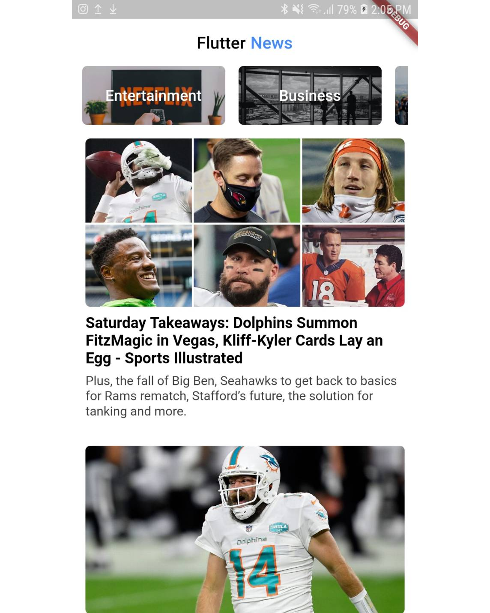

# Dailynews

1. Fetch Json Response from newsapi.org
2. Loading indicator and tenrary operations
3. Set State.
4. Create List and load JSON Data and Display
5. Widgets and much more. 

Youtube tutorial: https://www.youtube.com/watch?v=arMlymwP1Z0&list=PLKETiCsEsH0oSHoAUyHY3-baH-rC8SiwY

